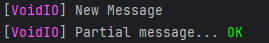

# VoidIO

A High-performance Cross-platform I/O Library for Rust.

### Logging:
```rust
use voidio::console::{fstdout, Component, Console};

fn formatted_stdout()
{
    let cout = fstdout(|msg| {
        "[" + Component::text("VoidIO").with_color(0xFF55FF) + "] " + msg
    });
    
    cout.send("New Message");
    
    cout.write("Partial message... ");
    
    cout.send(Component::text("OK").with_color(0x00FF00));
}
```
**Output**:

